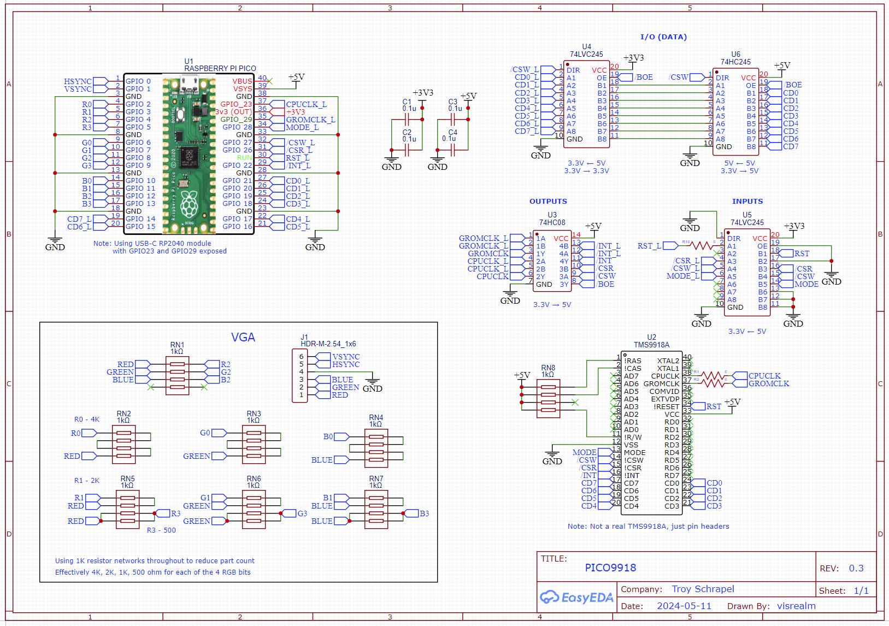
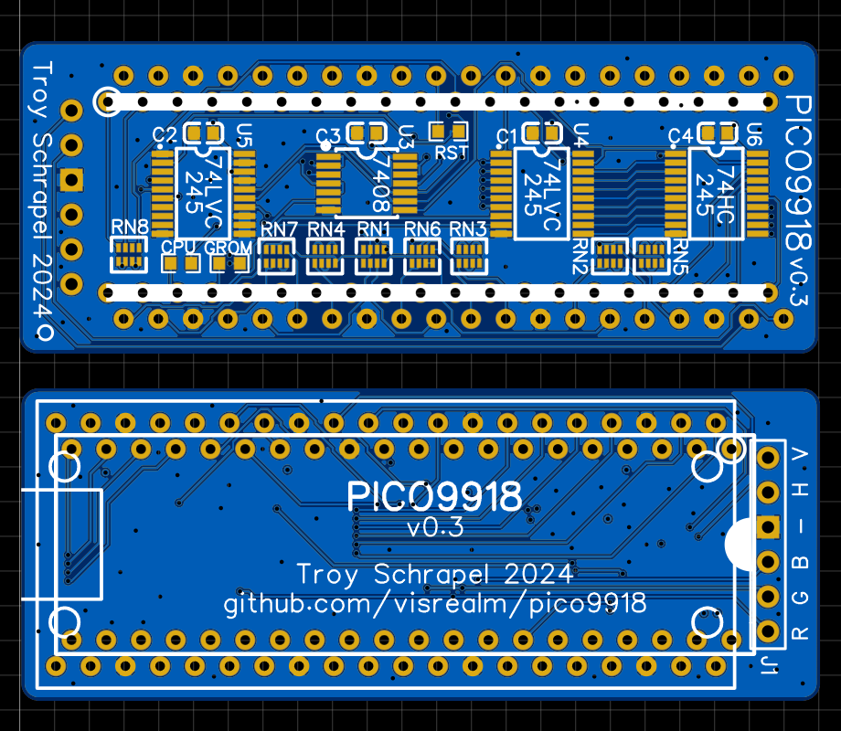

# PICO9918

A drop-in replacement for a classic TMS9918A VDP using a Raspberry Pi Pico.

Currently in the early prototyping stages, but looks very promising on my TI-99/4A and [HBC-56](https://github.com/visrealm/hbc-56) test beds.

The TMS9918A emulation is handled by my [vrEmuTms9918 library](https://github.com/visrealm/vrEmuTms9918) which is included as a submodule here.

## Hardware

v0.3 Schematic and Gerber available now. This revision has been tested on my two TI-99/4As (PAL and NTSC) and my HBC-56 and is fully functional, however it is not representative of the final PCB design which will include the RP2040 directly on the PCB.

### PCB v0.3 Notes

There are a number of 0Ohm resistors (jumpers). You may need to omit the RST resistor. On some machines, the extra time is required to bootstrap the Pico. This will be changed to a soft reset on v0.4.

### Raspberry Pi Pico Module

Note: Due to GROMCLK and CPUCLK using GPIO23 and GPIO29, a genuine Raspberry Pi Pico can't be used. v0.3 of the PCB is designed for the DWEII? RP2040 USB-C module which exposes these additional GPIOs. A future pico9918 revision will do without an external RP2040 board and use the RP2040 directly.

Purchase links:
 * https://www.amazon.com/RP2040-Board-Type-C-Raspberry-Micropython/dp/B0CG9BY48X
 * https://www.aliexpress.com/item/1005007066733934.html

I could reduce the VGA bit depth to 9-bit or 10-bit to allow the use of a genuine Raspberry Pi Pico board, but given the longer-term plan is to use the RP2040 directly, I've decided to go this way for the prototype.

## Firmware

If you're not interested in building the firmware yourself, you'll find the latest firmware in the [Releases](https://github.com/visrealm/pico9918/releases).

To install, just hold the 'Mode' buton while plugging the Pico into a PC, then drag the pico9918.uf2 file on to the new USB drive which should have the volume label RPI-RP2. The Pico will restart (and disconnect) automatically.

## Development environment

To set up your development environment for the Raspberry Pi Pico, follow the [Raspberry Pi C/C++ SDK Setup](https://www.raspberrypi.com/documentation/microcontrollers/c_sdk.html) instructions.

#### Windows

For Windows users, there is a pre-packaged installer provided by the Raspberry Pi Foundation: https://github.com/raspberrypi/pico-setup-windows/releases/. Once installed, just open the pre-configured "Pico - Visual Studio Code" from your start menu.

The build system expects `python3` to be available. If you have installed Python 3 outside of the Microsoft Store, you may need to alias your Python executable.

You can do this from an elevated (Administator) command prompt in your python directory e.g. `C:\Program Files\Python310\` by creating a symlink with the command: `mklink python3.exe python.exe`.

## Videos

Initial "raw" videos recorded in the moments following the first boot on my TI-99/4A.

These videos are showing the v0.2 hardware with an external Pi Pico providing the required GROMCLK signal to the TI-99. This signal has been added to v0.3. I'm still waiting on v0.3 boards to arrive.

### It freaking works!

### Don't mess with Texas!

### 80 column mode

## License
This code is licensed under the [MIT](https://opensource.org/licenses/MIT "MIT") license
