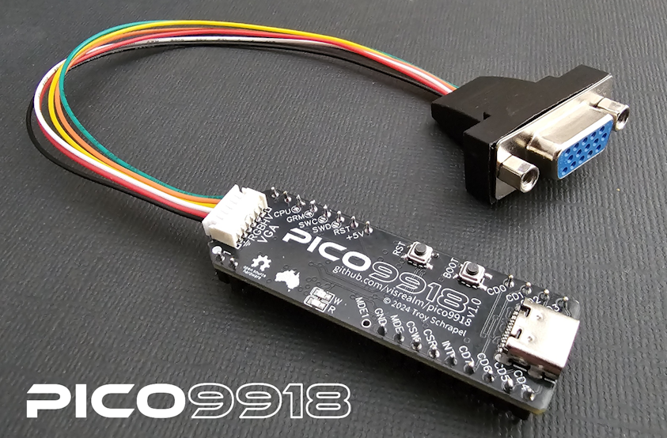
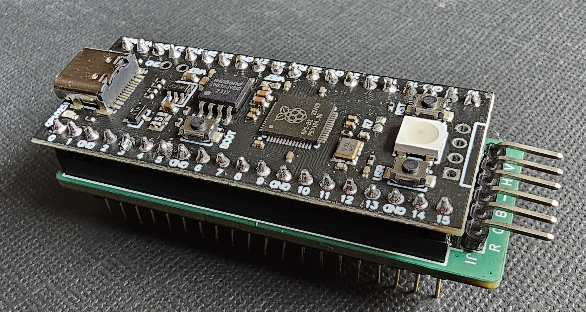
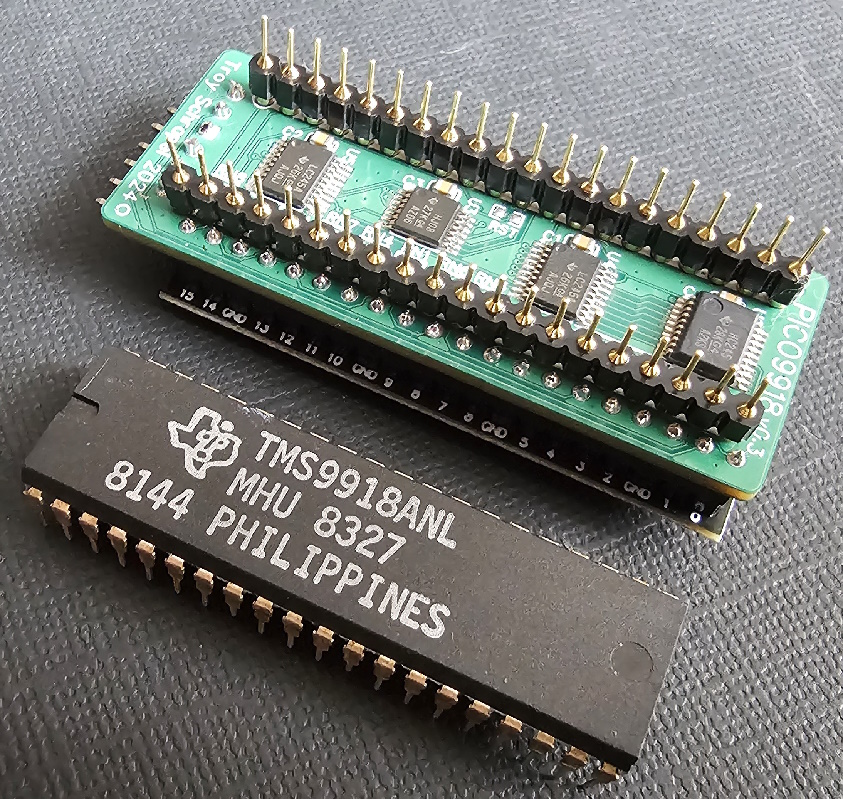

# PICO9918

A drop-in replacement for a classic TMS9918A VDP using a Raspberry Pi Pico.

The TMS9918A emulation is handled by my [vrEmuTms9918 library](https://github.com/visrealm/vrEmuTms9918) which is included as a submodule here

## Supported devices

This is a list of devices the PICO9918 has been tested and confirmed to work on. 

* [Texas Instruments TI-99/4A](https://en.wikipedia.org/wiki/TI-99/4A) (NTSC and PAL)
* [Texas Instruments TI-99/4QI](http://www.mainbyte.com/ti99/computers/ti99qi.html)
* [Dan Werner TI-99/22](https://github.com/danwerner21/TI99_22)
* [ColecoVision](https://en.wikipedia.org/wiki/ColecoVision) (NTSC and PAL)
* [Coleco ADAM](https://en.wikipedia.org/wiki/Coleco_Adam) (NTSC)
* [AtariBits CV-NUC+](https://ataribits.weebly.com/cv-nuc.html)
* [Memotech MTX500](https://en.wikipedia.org/wiki/Memotech_MTX)
* [MSX](https://en.wikipedia.org/wiki/MSX)
  * [Casio MX-10](https://www.msx.org/wiki/Casio_MX-10)
  * [Casio PV-7](https://www.msx.org/wiki/Casio_PV-7)
  * [Casio PV-16](https://www.msx.org/wiki/Casio_PV-16)
  * [Gradiente Expert XP-800](https://www.msx.org/wiki/Gradiente_Expert_XP-800)
  * [National CF-2700](https://www.msx.org/wiki/National_CF-2700)
  * [Sharp HB-8000](https://www.msx.org/wiki/Sharp_HB-8000)
  * [Sony HB-75](https://www.msx.org/wiki/Sony_HB-75)
  * [Toshiba HX-10](https://www.msx.org/wiki/Toshiba_HX-10)
  * [Toshiba HX-21](https://www.msx.org/wiki/Toshiba_HX-21)
  * [Yamaha YIS-503](https://www.msx.org/wiki/Yamaha_YIS-503)
* [NABU Personal Computer](https://en.wikipedia.org/wiki/NABU_Network)
* [Powertran Cortex](http://powertrancortex.com/)
* [Sega SG-1000 / SC-3000](https://en.wikipedia.org/wiki/SG-1000#SC-3000)
* [Sord M5](https://en.wikipedia.org/wiki/Sord_M5)
* [Tomy Pyūta / Tomy Tutor](https://en.wikipedia.org/wiki/Tomy_Tutor)
* [Tomy Pyūta Jr](http://videogamekraken.com/pyuta-jr-by-tomy)
* [VTech CreatiVision / Dick Smith Wizzard](https://en.wikipedia.org/wiki/VTech_CreatiVision)

Homebrews:

* Troy Schrapel's [HBC-56](https://github.com/visrealm/hbc-56)
* Stuart Connor's [TM990](http://www.stuartconner.me.uk/tm990/tm990.htm)
* John Winans' [Z80-Retro](https://github.com/Z80-Retro)
* Martin's [Z80Ardu](https://www.dev-tronic.de/?p=74)

If you have tested the PICO9918 on any other device, please let me know and I'll happily update this list. :)

### Unsupported devices

So far, there aren't any. 

# F18A compatibility

Work is being done to add F18A compatibility to the PICO9918. The video below was captured directly from the PICO9918 VGA output running various F18A demos on a TI-99/4A.

Pre-release firmware for F18A compatibility mode is available in [Releases](https://github.com/visrealm/pico9918/releases/tag/v0.4.1-f18a-preview1).

## Purchasing options

Fully assembled and tested PICO9918 v1.2s are available on my Tindie store:

Also (more convenient for North America)

<a href="https://www.arcadeshopper.com/wp/store/#!/~/search/keyword=*PICO9918*"></img></a>

## Hardware

There are two main variants of the hardware. 

### v1.x (v1.2, v1.1, v1.0 and v0.4)

PICO9918 v1.2 is the single board version which doesn't require a piggy-backed Pi Pico. This is the version you can currently buy pre-assembled from Tindie and ArcadeShopper.

### v0.3

v0.3 is relatively cheap and easy to build, schematic and gerbers are available. This version makes use of an external Pi Pico module piggy-backed onto the PICO9918 PCB.

### Schematics

Schematics and Gerbers are available in [/pcb](pcb)

## Firmware

If you're not interested in building the firmware yourself, you'll find the latest firmware in the [Releases](https://github.com/visrealm/pico9918/releases).

To install, just hold the 'BOOTSEL' (or 'BOOT') button while plugging the Pico into a PC, then drag the pico9918.uf2 file on to the new USB drive which should have the volume label RPI-RP2. The Pico will restart (and disconnect) automatically.

## Development environment

To set up your development environment for the Raspberry Pi Pico, follow the [Raspberry Pi C/C++ SDK Setup](https://www.raspberrypi.com/documentation/microcontrollers/c_sdk.html) instructions. The latest PICO9918 source can be configured and built using the official [Raspberry Pi Pico VSCode plugin](https://github.com/raspberrypi/pico-vscode).

#### Windows

The build system expects `python3` to be available. If you have installed Python 3 outside of the Microsoft Store, you may need to alias your Python executable.

You can do this from an elevated (Administator) command prompt in your python directory e.g. `C:\Program Files\Python310\` by creating a symlink with the command: `mklink python3.exe python.exe`.

The custom python build tools are used to convert binary data (images) into code. These also require the [pillow](https://pypi.org/project/pillow/) library - ([Installation instructions for pillow](https://pillow.readthedocs.io/en/latest/installation/basic-installation.html))

## Discussion

For all the latest news and discussion on the PICO9918, you can follow [this AtariAge thread](https://forums.atariage.com/topic/367656-introducing-the-pico9918-a-tms9918a-drop-in-replacement-powered-by-a-pi-pico/)

## Videos

Initial "raw" videos recorded in the moments following the first boot on my TI-99/4A.

These videos are showing the v0.2 hardware with an external Pi Pico providing the required GROMCLK signal to the TI-99. This signal has been added to v0.3. I'm still waiting on v0.3 boards to arrive.

### It freaking works!

### Don't mess with Texas!

### 80 column mode

And now v0.4 - the single board version:

### v0.4 prototype working!

### F18A mode development preview

## Licensing

### Hardware
The hardware design files in this repository are licensed under the CERN-OHL-S. See [LICENSE_HARDWARE.md](LICENSE_HARDWARE.md) for details.

### Firmware
The firmware code in this repository is licensed under the MIT License. See [LICENSE_FIRMWARE.md](LICENSE_FIRMWARE.md) for details.
