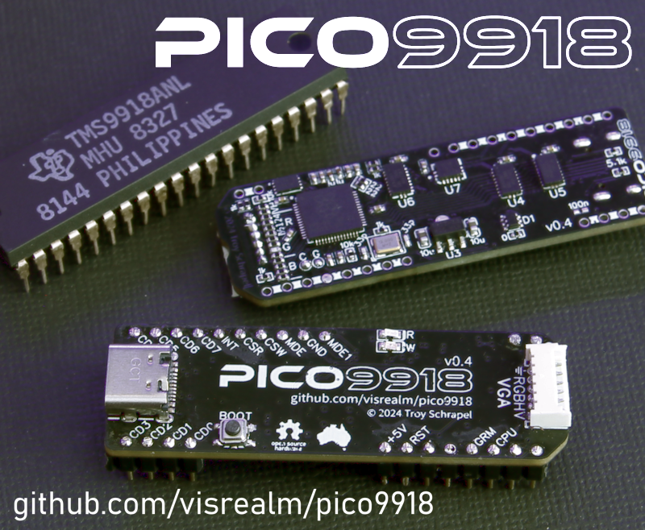

# PICO9918

A drop-in replacement for a classic TMS9918A VDP using a Raspberry Pi Pico.

The TMS9918A emulation is handled by my [vrEmuTms9918 library](https://github.com/visrealm/vrEmuTms9918) which is included as a submodule here.

## Supported devices

This is a list of devices the PICO9918 has been tested and confirmed to work on. 

* Texas Instruments TI-99/4A (NTSC and PAL)
* Texas Instruments TI-99/4QI
* CBS ColecoVision (NTSC and PAL)
* Powertran Cortex
* Casio PV-7 (MSX)
* NABU Personal Computer

Homebrews:

* Troy Schrapel's [HBC-56](https://github.com/visrealm/hbc-56)
* Stuart Connor's [TM990](http://www.stuartconner.me.uk/tm990/tm990.htm)

If you have tested the PICO9918 on any other device, please let me know and I'll happily update this list. :)

### Unsupported devices

So far, there aren't any. 

## Purchasing options

Fully assembled and tested PICO9918 v1.0s are available on my Tindie store:

Also (more convenient for North America)

<a href="https://www.arcadeshopper.com/wp/store/#!/Pico9918-V1-0-VDP-replacement/p/692136720"></img></a>

## Hardware

There are two main variants of the hardware.

### v1.0 (formerly v0.4)

PICO9918 v1.0 is the single board version which doesn't require a piggy-backed Pi Pico. It is in the process of being manufactured now and is based on v0.4 seen below:

Once I have tested v1.0 and made it available, I will publish the schematics and gerbers for this version.

### v0.3

v0.3 schematic and gerber available now. This revision has been tested on my two TI-99/4As (PAL and NTSC) and my HBC-56 and is fully functional, however it is not representative of the final PCB design which will include the RP2040 directly on the PCB.

### PCB v0.3 Notes

There are a number of 0Ohm resistors (jumpers). You may need to omit the RST resistor. On some machines, the extra time is required to bootstrap the Pico. This will be changed to a soft reset on v0.4.

### Raspberry Pi Pico Module

Note: Due to GROMCLK and CPUCLK using GPIO23 and GPIO29, a genuine Raspberry Pi Pico can't be used. v0.3 of the PCB is designed for the DWEII? RP2040 USB-C module which exposes these additional GPIOs. A future pico9918 revision will do without an external RP2040 board and use the RP2040 directly.

Purchase links:
 * https://www.amazon.com/RP2040-Board-Type-C-Raspberry-Micropython/dp/B0CG9BY48X
 * https://www.aliexpress.com/item/1005007066733934.html

I could reduce the VGA bit depth to 9-bit or 10-bit to allow the use of a genuine Raspberry Pi Pico board, but given the longer-term plan is to use the RP2040 directly, I've decided to go this way for the prototype.

## Firmware

If you're not interested in building the firmware yourself, you'll find the latest firmware in the [Releases](https://github.com/visrealm/pico9918/releases).

To install, just hold the 'BOOTSEL' (or 'BOOT') button while plugging the Pico into a PC, then drag the pico9918.uf2 file on to the new USB drive which should have the volume label RPI-RP2. The Pico will restart (and disconnect) automatically.

## Development environment

To set up your development environment for the Raspberry Pi Pico, follow the [Raspberry Pi C/C++ SDK Setup](https://www.raspberrypi.com/documentation/microcontrollers/c_sdk.html) instructions.

#### Windows

For Windows users, there is a pre-packaged installer provided by the Raspberry Pi Foundation: https://github.com/raspberrypi/pico-setup-windows/releases/. Once installed, just open the pre-configured "Pico - Visual Studio Code" from your start menu.

The build system expects `python3` to be available. If you have installed Python 3 outside of the Microsoft Store, you may need to alias your Python executable.

You can do this from an elevated (Administator) command prompt in your python directory e.g. `C:\Program Files\Python310\` by creating a symlink with the command: `mklink python3.exe python.exe`.

## Discussion

For all the latest news and discussion on the PICO9918, you can follow [this AtariAge thread](https://forums.atariage.com/topic/367656-introducing-the-pico9918-a-tms9918a-drop-in-replacement-powered-by-a-pi-pico/)

## Videos

Initial "raw" videos recorded in the moments following the first boot on my TI-99/4A.

These videos are showing the v0.2 hardware with an external Pi Pico providing the required GROMCLK signal to the TI-99. This signal has been added to v0.3. I'm still waiting on v0.3 boards to arrive.

### It freaking works!

### Don't mess with Texas!

### 80 column mode

And now v0.4 - the single board version:

### v0.4 prototype working!

## Licensing

### Hardware
The hardware design files in this repository are licensed under the CERN-OHL-S. See [LICENSE_HARDWARE.md](LICENSE_HARDWARE.md) for details.

### Firmware
The firmware code in this repository is licensed under the MIT License. See [LICENSE_FIRMWARE.md](LICENSE_FIRMWARE.md) for details.
