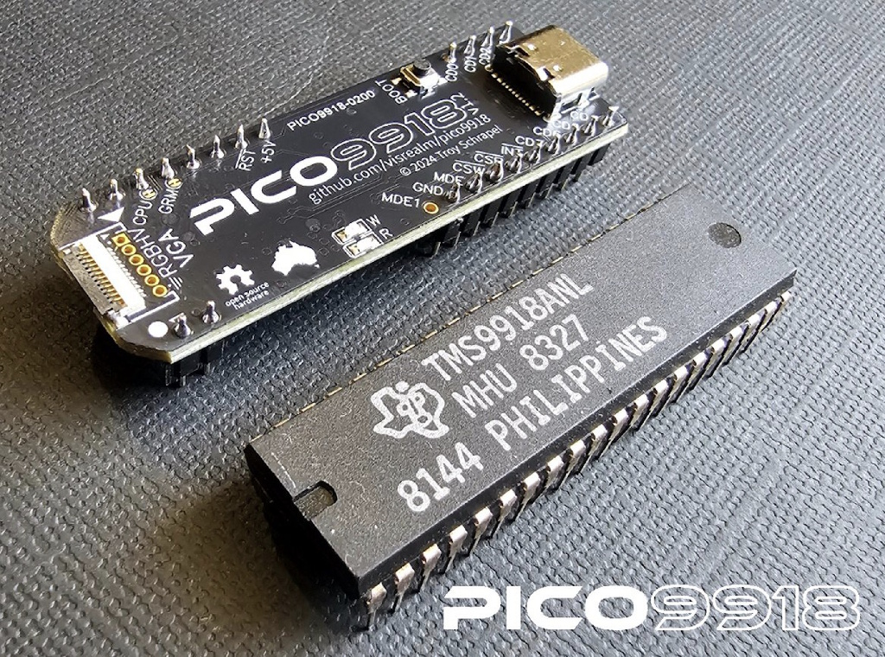
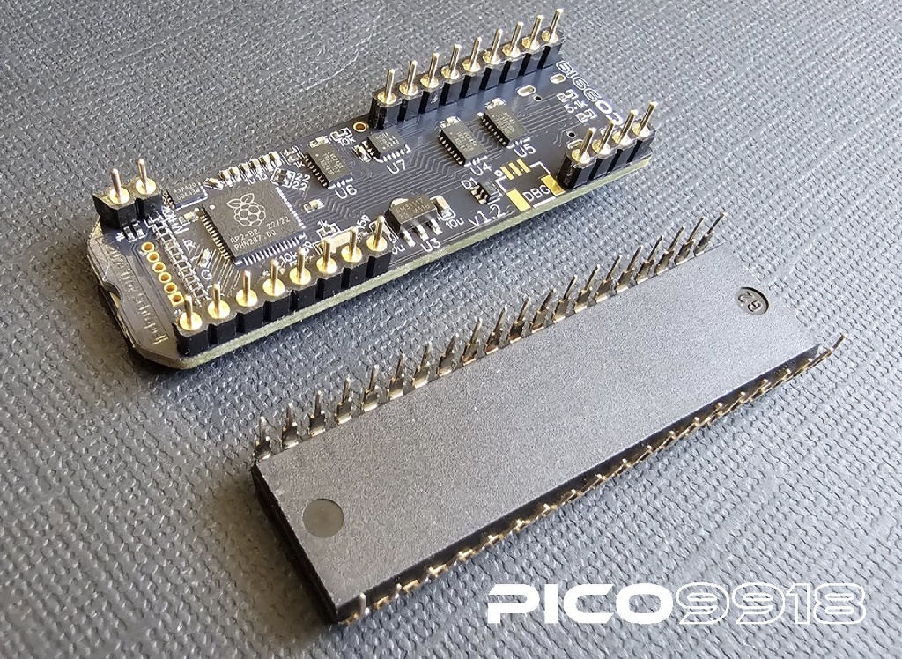
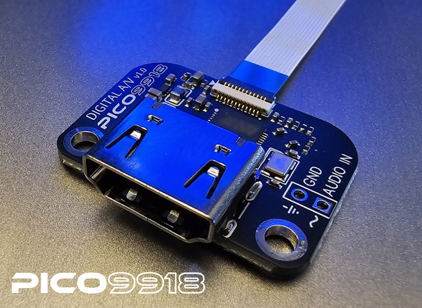
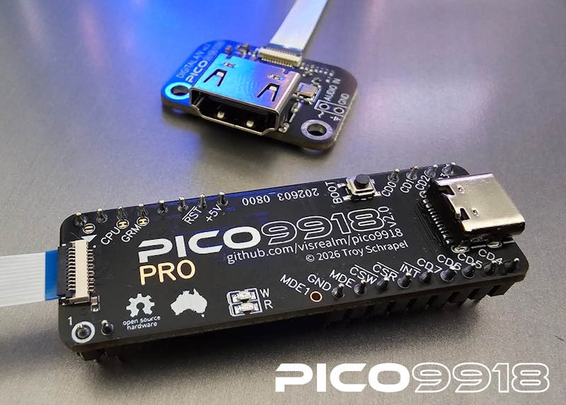
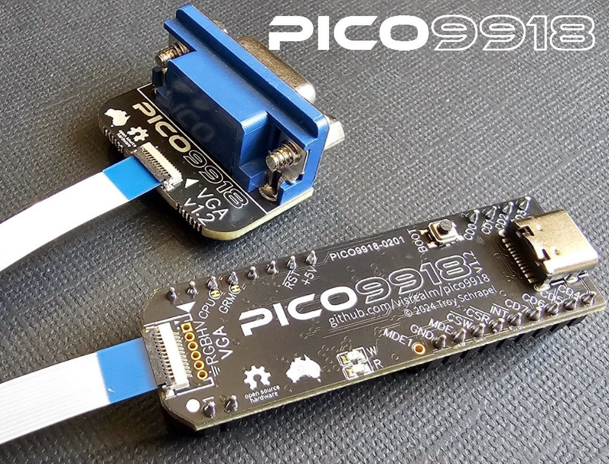
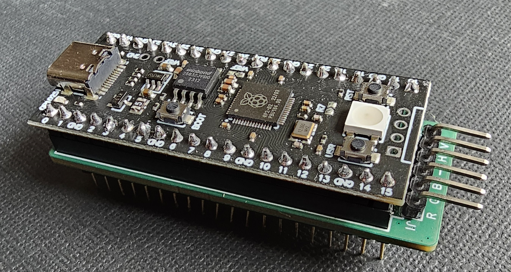

# PICO9918

A drop-in replacement for a classic TMS9918A VDP powered by the Raspberry Pi Pico RP2040 (and now RP2350) microcontroller.

<p align="left"><a href="img/pico9918_v1_2_top_sm.jpg"></a> <a href="img/pico9918_v1_2_bottom_sm.jpg"></a></p>

The PICO9918 PRO can replace all classic VDP models (TMS9918, TMS9918A, TMS9928A, TMS9929A, TMS9118, TMS9128, TMS9129), providing a crisp VGA, HDMI or SCART RGB signal from your retrocomputer.

The PICO9918 has been tested on over 30 classic models of TI-99, Coleco, MSX, NABU, Memotech, Sega and many more. See the [full list below](#supported-devices).

The TMS9918A emulation is handled by my [vrEmuTms9918 library](https://github.com/visrealm/vrEmuTms9918) which is included as a submodule here

## Contents

* [Build status](#build-status)
* [Supported devices](#supported-devices)
* [Digital A/V (HDMI) Dongle](#digital-av-hdmi-dongle-new)
* [F18A compatibility](#f18a-compatibility)
* [Purchasing options](#purchasing-options)
* [Hardware](#hardware)
* [Firmware](#firmware)
* [Configurator](#configurator)
* [Documentation](#documentation)
* [Building](#building)
* [Thanks](#thanks)
* [Discussion](#discussion)
* [Videos](#videos)
* [Licensing](#licensing)

## Build status

### Main Branch

| Build | Windows | Linux | macOS |
|-------|---------|-------|-------|
| Firmware | [](https://github.com/visrealm/pico9918/actions/workflows/firmware-windows.yml) | [](https://github.com/visrealm/pico9918/actions/workflows/firmware-linux.yml) | [](https://github.com/visrealm/pico9918/actions/workflows/firmware-macos.yml) |
| Configurator | [](https://github.com/visrealm/pico9918/actions/workflows/configurator-windows.yml) | [](https://github.com/visrealm/pico9918/actions/workflows/configurator-linux.yml) | [](https://github.com/visrealm/pico9918/actions/workflows/configurator-macos.yml) |

### Dev Branch

| Build | Windows | Linux | macOS |
|-------|---------|-------|-------|
| Firmware | [](https://github.com/visrealm/pico9918/actions/workflows/firmware-windows.yml) | [](https://github.com/visrealm/pico9918/actions/workflows/firmware-linux.yml) | [](https://github.com/visrealm/pico9918/actions/workflows/firmware-macos.yml) |
| Configurator | [](https://github.com/visrealm/pico9918/actions/workflows/configurator-windows.yml) | [](https://github.com/visrealm/pico9918/actions/workflows/configurator-linux.yml) | [](https://github.com/visrealm/pico9918/actions/workflows/configurator-macos.yml) |

## Supported devices

This is a list of devices the PICO9918 has been tested and confirmed to work on.
📖 For detailed compatibility notes, installation tips, and configurator support for each device, see the [Supported Devices](https://github.com/visrealm/pico9918/wiki/Supported-Devices) wiki page.

* [ColecoVision](https://en.wikipedia.org/wiki/ColecoVision) ([📖 Wiki](https://github.com/visrealm/pico9918/wiki/ColecoVision))
  * [Coleco ADAM](https://en.wikipedia.org/wiki/Coleco_Adam)
  * [AtariBits CV-NUC+](https://ataribits.weebly.com/cv-nuc.html)
  * [Bit Dina 2 in one](https://segaretro.org/Dina_2_in_one)
* [Memotech MTX500](https://en.wikipedia.org/wiki/Memotech_MTX) ([📖 Wiki](https://github.com/visrealm/pico9918/wiki/Memotech-MTX))
* [MSX](https://en.wikipedia.org/wiki/MSX) ([📖 Wiki](https://github.com/visrealm/pico9918/wiki/MSX))
  * [Casio MX-10](https://www.msx.org/wiki/Casio_MX-10)
  * [Casio PV-7](https://www.msx.org/wiki/Casio_PV-7)
  * [Casio PV-16](https://www.msx.org/wiki/Casio_PV-16)
  * [Gradiente Expert XP-800](https://www.msx.org/wiki/Gradiente_Expert_XP-800)
  * [National CF-2700](https://www.msx.org/wiki/National_CF-2700)
  * [Sanyo PHV-30N](https://www.msx.org/wiki/Sanyo_PHC-30N)
  * [Sharp HB-8000](https://www.msx.org/wiki/Sharp_HB-8000)
  * [Sony HB-75](https://www.msx.org/wiki/Sony_HB-75)
  * [Spectravideo SVI-728](https://www.msx.org/wiki/Spectravideo_SVI-728)
  * [Toshiba HX-10](https://www.msx.org/wiki/Toshiba_HX-10)
  * [Toshiba HX-21](https://www.msx.org/wiki/Toshiba_HX-21)
  * [Yamaha CX5M](https://www.msx.org/wiki/Yamaha_CX5M)
  * [Yamaha YIS-503](https://www.msx.org/wiki/Yamaha_YIS-503)
* [NABU Personal Computer](https://en.wikipedia.org/wiki/NABU_Network) ([📖 Wiki](https://github.com/visrealm/pico9918/wiki/NABU-Personal-Computer))
* [Powertran Cortex](http://powertrancortex.com/) ([📖 Wiki](https://github.com/visrealm/pico9918/wiki/Powertran-Cortex))
* [Sega SG-1000 / SC-3000](https://en.wikipedia.org/wiki/SG-1000#SC-3000) ([📖 Wiki](https://github.com/visrealm/pico9918/wiki/Sega-SG-1000))
* [Sega SG-1000 II](https://segaretro.org/SG-1000_II)
* [Sord M5](https://en.wikipedia.org/wiki/Sord_M5) ([📖 Wiki](https://github.com/visrealm/pico9918/wiki/Sord-M5))
* [Texas Instruments TI-99](https://en.wikipedia.org/wiki/TI-99/4A) ([📖 Wiki](https://github.com/visrealm/pico9918/wiki/Texas-Instruments-TI-99))
  * [Texas Instruments TI-99/4](https://en.wikipedia.org/wiki/TI-99/4)
  * [Texas Instruments TI-99/4A](https://en.wikipedia.org/wiki/TI-99/4A)
  * [Texas Instruments TI-99/4QI](http://www.mainbyte.com/ti99/computers/ti99qi.html)
  * [Dan Werner TI-99/22](https://github.com/danwerner21/TI99_22)
* [Tomy Pyūta / Tomy Tutor](https://en.wikipedia.org/wiki/Tomy_Tutor) ([📖 Wiki](https://github.com/visrealm/pico9918/wiki/Tomy-Tutor))
* [Tomy Pyūta Jr](http://videogamekraken.com/pyuta-jr-by-tomy)
* [VTech CreatiVision / Dick Smith Wizzard](https://en.wikipedia.org/wiki/VTech_CreatiVision) ([📖 Wiki](https://github.com/visrealm/pico9918/wiki/CreatiVision))

Homebrews ([📖 Wiki](https://github.com/visrealm/pico9918/wiki/Homebrew-Projects)):

* Troy Schrapel's [HBC-56](https://github.com/visrealm/hbc-56)
* Stuart Connor's [TM990](http://www.stuartconner.me.uk/tm990/tm990.htm)
* John Winans' [Z80-Retro](https://github.com/Z80-Retro)
* Martin's [Z80Ardu](https://www.dev-tronic.de/?p=74)

If you have tested the PICO9918 on any other device, please let me know and I'll happily update this list. :)

### Unsupported devices

So far, there aren't any. 

# Digital A/V (HDMI) Dongle [NEW]

The new Digital A/V dongle provides video and audio direct to any HDMI compatible display. The new dongle is fully compatible with all previous FFC-equipped PICO9918 boards (v1.2, v1.3 and PRO v2.0) and are available to purchase either with a new PICO9918 PRO or separately.



📖 For full details, see the [Digital AV Dongle](https://github.com/visrealm/pico9918/wiki/Digital-AV-Dongle) wiki page. See [Hardware Setup](https://github.com/visrealm/pico9918/wiki/Hardware-Setup#ffc-connector) for FFC cable connection instructions.

# F18A compatibility

The PICO9918 also includes F18A compatibility in firmware v1.0.0+. The video below was captured directly from the PICO9918 VGA output running various F18A demos on a TI-99/4A.

[](https://youtu.be/TabTIPL1xQY)

📖 For technical details on the enhanced registers, ECM, GPU, and palette RAM, see the [F18A Programmer's Reference](https://github.com/visrealm/pico9918/wiki/F18A-Programmers-Reference) wiki page.

## Purchasing options

Fully assembled and tested PICO9918 PROs are available here:

| Link | Store | Best For |
  |------|-------|----------|
  | <a href="https://www.tindie.com/search/?q=PICO9918"></a> | Tindie (visrealm) | All regions |
  | <a href="https://lectronz.com/stores/visrealm" alt="I sell on Lectronz"></a> | Lectronz (visrealm) | All regions. Best choice for EU |
  | <a href="https://www.arcadeshopper.com/wp/store/#!/~/search/keyword=*PICO9918*"></a> | Arcade Shopper | US |
  
## Hardware

There are three main variants of the hardware.

### PRO v2.x (v2.0)

This is the latest version, poewered by the more powerful RP2350. This hardware upgrade will allow for additional VRAM and display modes in the future, including V9938 support.

<p align="left"><a href="img/pico9918pro_800_1.jpg"></a></p>

This is the version you can currently buy pre-assembled from Tindie and ArcadeShopper.

### v1.x (v1.3, v1.2, v1.1, v1.0 and v0.4)

PICO9918 v1.3 was the first single board version which doesn't require a piggy-backed Pi Pico.

<p align="left"><a href="img/pico9918_v1_2_sm.jpg"></a></p>

### v0.3

v0.3 is relatively cheap and easy to build, schematic and gerbers are available. This version makes use of an external Pi Pico module piggy-backed onto the PICO9918 PCB.

<p align="left"><a href="img/pico9918_v0_3_sm.jpg"></a></p>

I also have the [v0.3 board as a PCBWay Project](https://www.pcbway.com/project/shareproject/PICO9918_Drop_in_replacement_for_the_classic_TMS9918A_family_of_VDPs_fc11359a.html) you can order there.

📖 For detailed specifications and setup instructions, see the [Hardware](https://github.com/visrealm/pico9918/wiki/Hardware) and [Hardware Setup](https://github.com/visrealm/pico9918/wiki/Hardware-Setup) wiki pages.

### Schematics

Schematics and Gerbers are available in [/pcb](pcb)

## Firmware

If you're not interested in building the firmware yourself, you'll find the latest firmware in the [Releases](https://github.com/visrealm/pico9918/releases).

To install, just hold the 'BOOT' button while plugging the Pico into a PC, then drag the pico9918.uf2 file on to the new USB drive which should have the volume label RPI-RP2. The Pico will restart (and disconnect) automatically.

📖 For detailed information on firmware installation, output modes, and updates, see the [Firmware](https://github.com/visrealm/pico9918/wiki/Firmware) wiki page.

## Configurator

The configurator is a software tool used to modify PICO9918 configuration options, including:

* Clock rate
* Scanline CRT effect
* Scanline sprite limit
* Default palette
* [📖 Diagnostic overlays](https://github.com/visrealm/pico9918/wiki/Diagnostic-Overlays)

Additionally, firmware updates can be provided via the Configurator. The full configurator is available for the **TI-99/4A**, **ColecoVision** and **MSX**. With cut-down builds (without firmware updates) available for several other machines.

📖 For full details, see the [Configurator](https://github.com/visrealm/pico9918/wiki/Configurator) wiki page.

See the configurator in action:

[](https://youtu.be/PBArYupT9qM?t=9)

The configurator was written in a [custom fork of CVBasic](https://github.com/visrealm/CVBasic) with the full source available in [/configtool](configtool).

If you're not interested in building the configurator yourself, you'll find the latest builds in the [Releases](https://github.com/visrealm/pico9918/releases).

### Web-based Configurator

If you don't have a device supported by the native configurator, the [Web-based PICO9918 Configurator](https://visrealm.github.io/pico9918/config/index.html) can be used to generate a config .uf2 file compatible with both the PICO9918 and PICO9918 PRO. Just drag-and-drop the resulting file onto your device using the same method as for firmware updates.

## Documentation

For detailed documentation covering hardware setup, firmware, the configurator, supported devices, F18A compatibility and more, visit the **[PICO9918 Wiki](https://github.com/visrealm/pico9918/wiki)**.

## Building

### Quick start
Build both firmware and configurator ROMs:

```bash
# Automatic SDK download (recommended)
mkdir build && cd build
cmake .. -DPICO_SDK_FETCH_FROM_GIT=ON -DPICO_SDK_FETCH_FROM_GIT_TAG=2.1.1
cmake --build .
```

Output in `build/dist/`: firmware `.uf2` file and configurator ROMs for all retro platforms.

### Platform-Specific Setup Required

Each platform requires specific toolchain installation:
- **Windows**: ARM GNU Toolchain 13.2.1-1.1, Python with pillow
- **Linux**: `build-essential cmake python3 python3-pip git gcc-arm-none-eabi`  
- **macOS**: Homebrew + ARM GNU Toolchain 13.2.1-1.1, may need `--break-system-packages`

All platforms use **Raspberry Pi Pico SDK 2.1.1** specifically (newer versions may cause issues).

### Detailed instructions

For detailed platform setup, development environment configuration, build options, individual platform builds, VSCode integration, and troubleshooting, see [BUILDING.md](BUILDING.md)

## Thanks

Special thanks to [JasonACT (AtariAge)](https://forums.atariage.com/profile/82586-jasonact/) for hand-crafting the F18A mode's on-board TMS9900 "GPU" in ARM assembly and providing other valuable input to the project.

## Discussion

For all the latest news and discussion on the PICO9918, you can follow [this AtariAge thread](https://forums.atariage.com/topic/367656-introducing-the-pico9918-a-tms9918a-drop-in-replacement-powered-by-a-pi-pico/)

## Videos

Initial "raw" videos recorded in the moments following the first boot on my TI-99/4A.

These videos are showing the v0.2 hardware with an external Pi Pico providing the required GROMCLK signal to the TI-99. This signal has been added to v0.3. I'm still waiting on v0.3 boards to arrive.

### It freaking works!
[](https://youtu.be/Ri09dCjWxGE)

### Don't mess with Texas!
[](https://youtu.be/ljNRFKbOGJs)

### 80 column mode
[](https://youtu.be/qdCapu0CVJ8)

And now v0.4 - the single board version:

### v0.4 prototype working!
[](https://youtu.be/KSbJnAwclQw)

### F18A mode development preview
[](https://youtu.be/TabTIPL1xQY)

## Licensing

### Hardware
The hardware design files in this repository are licensed under the CERN-OHL-S. See [LICENSE_HARDWARE.md](LICENSE_HARDWARE.md) for details.

### Firmware
The firmware code in this repository is licensed under the MIT License. See [LICENSE_FIRMWARE.md](LICENSE_FIRMWARE.md) for details.


