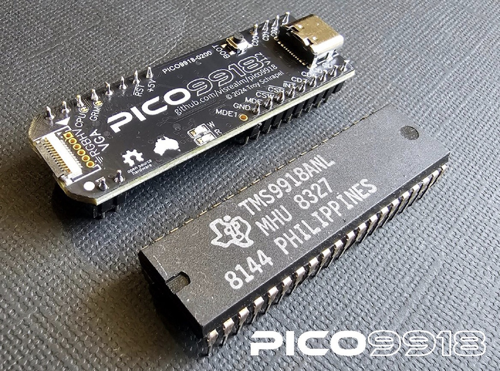
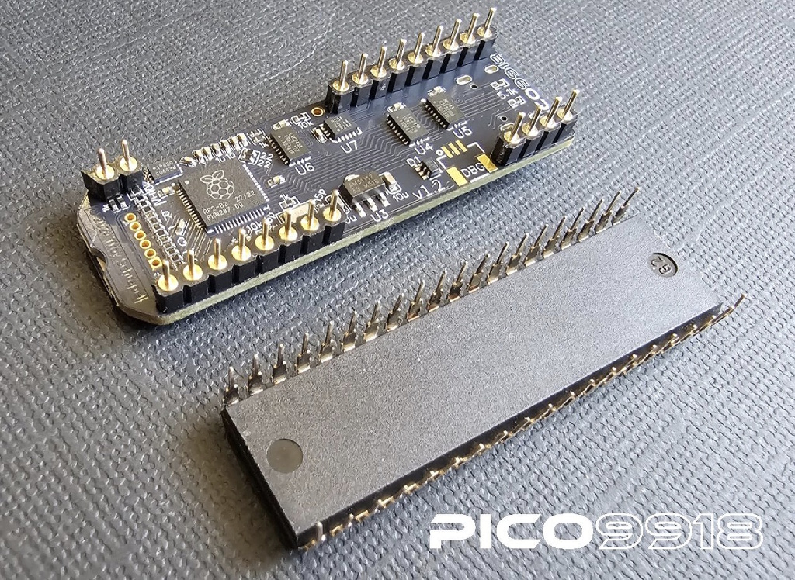
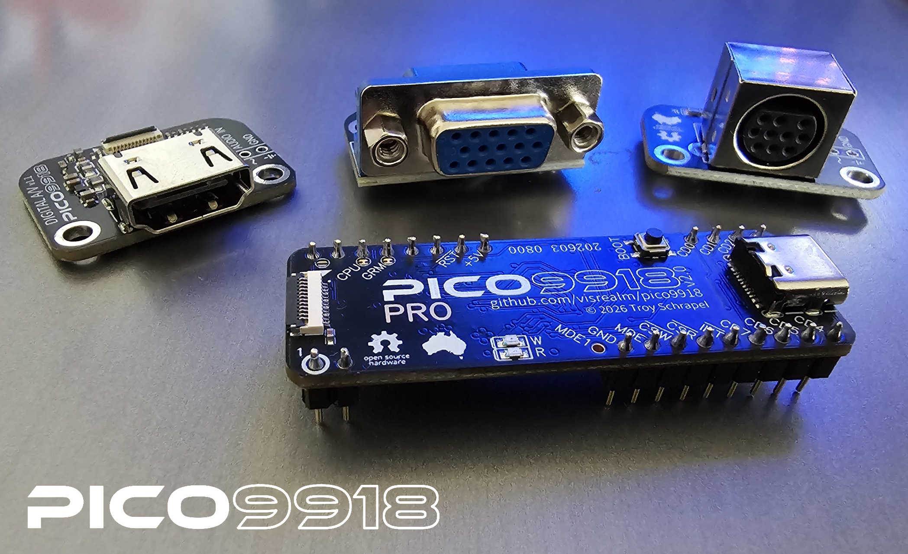
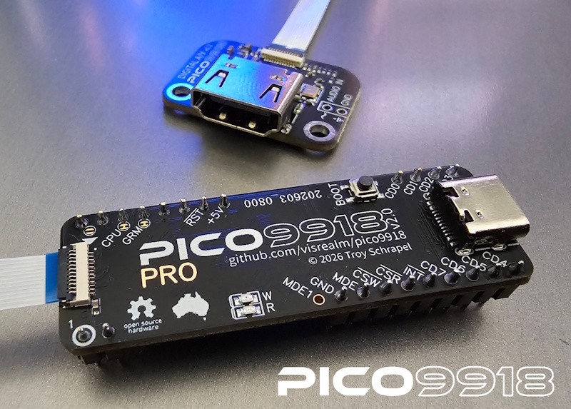
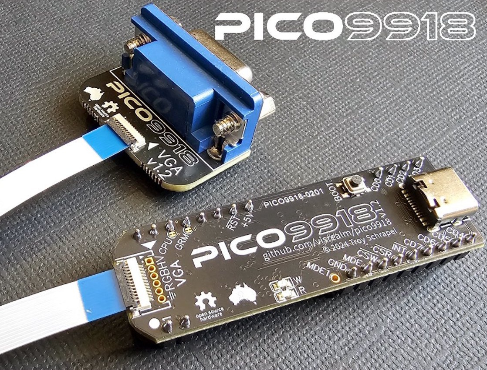
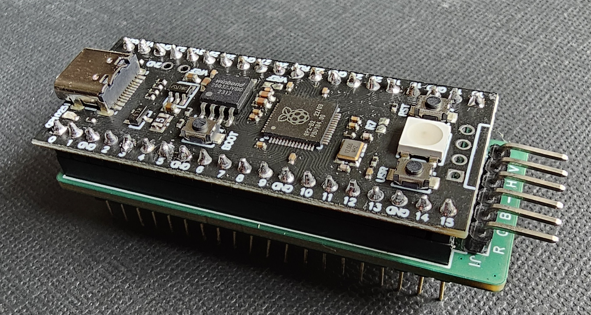

# PICO9918

A drop-in replacement for a classic TMS9918A VDP powered by the Raspberry Pi Pico RP2040 (and RP2350) microcontroller.

<p align="left"><a href="img/pico9918_v1_2_top_sm.jpg"></a> <a href="img/pico9918_v1_2_bottom_sm.jpg"></a></p>

The PICO9918 PRO can replace all classic VDP models (TMS9918, TMS9918A, TMS9928A, TMS9929A, TMS9118, TMS9128, TMS9129), providing a crisp VGA, HDMI or SCART RGB signal from your retrocomputer.

The PICO9918 has been tested on over 30 classic models of TI-99, Coleco, MSX, NABU, Memotech, Sega and many more. See the [full list below](#supported-devices).

The TMS9918A emulation is handled by my [vrEmuTms9918 library](https://github.com/visrealm/vrEmuTms9918) which is included as a submodule here.

## Contents

* [Supported devices](#supported-devices)
* [Video output](#video-output)
* [F18A compatibility](#f18a-compatibility)
* [Purchasing options](#purchasing-options)
* [Hardware](#hardware)
* [Firmware](#firmware)
* [Configurator](#configurator)
* [Roadmap](#roadmap)
* [Documentation](#documentation)
* [Building](#building)
* [Thanks](#thanks)
* [Discussion](#discussion)
* [Videos](#videos)
* [Licensing](#licensing)

## Supported devices

Every machine below has been tested and confirmed working. Each family has a wiki page with per-model notes, installation tips and configurator support.

| Family | Machines tested | Wiki page |
|--------|-----------------|-----------|
| [Texas Instruments TI-99](https://en.wikipedia.org/wiki/TI-99/4A) | TI-99/4, TI-99/4A, TI-99/4QI, TI-99/22 | [All models](https://github.com/visrealm/pico9918/wiki/Texas-Instruments-TI‐99) |
| [MSX](https://en.wikipedia.org/wiki/MSX) | 14 models from Casio, Gradiente, National, Sanyo, Sharp, Sony, Spectravideo, Toshiba and Yamaha | [All models](https://github.com/visrealm/pico9918/wiki/MSX) |
| [ColecoVision](https://en.wikipedia.org/wiki/ColecoVision) | ColecoVision, Coleco ADAM, AtariBits CV-NUC+, Bit Dina 2 in one | [All models](https://github.com/visrealm/pico9918/wiki/ColecoVision) |
| [Sega SG-1000](https://en.wikipedia.org/wiki/SG-1000#SC-3000) | SG-1000, SG-1000 II, SC-3000 | [All models](https://github.com/visrealm/pico9918/wiki/Sega-SG‐1000) |
| [Tomy Tutor](https://en.wikipedia.org/wiki/Tomy_Tutor) | Tomy Tutor, Pyūta, Pyūta Jr | [All models](https://github.com/visrealm/pico9918/wiki/Tomy-Tutor) |
| [VTech CreatiVision](https://en.wikipedia.org/wiki/VTech_CreatiVision) | CreatiVision, Dick Smith Wizzard | [All models](https://github.com/visrealm/pico9918/wiki/CreatiVision) |
| [NABU Personal Computer](https://en.wikipedia.org/wiki/NABU_Network) | NABU PC | [All models](https://github.com/visrealm/pico9918/wiki/NABU-Personal-Computer) |
| [Memotech MTX](https://en.wikipedia.org/wiki/Memotech_MTX) | MTX500 | [All models](https://github.com/visrealm/pico9918/wiki/Memotech-MTX) |
| [Sord M5](https://en.wikipedia.org/wiki/Sord_M5) | Sord M5 | [All models](https://github.com/visrealm/pico9918/wiki/Sord-M5) |
| [Powertran Cortex](http://powertrancortex.com/) | Cortex | [All models](https://github.com/visrealm/pico9918/wiki/Powertran-Cortex) |
| Homebrew | Troy Schrapel's [HBC-56](https://github.com/visrealm/hbc-56), Stuart Connor's [TM990](http://www.stuartconner.me.uk/tm990/tm990.htm), John Winans' [Z80-Retro](https://github.com/Z80-Retro), Martin's [Z80Ardu](https://www.dev-tronic.de/?p=74) | [All projects](https://github.com/visrealm/pico9918/wiki/Homebrew-Projects) |

Any other machine using a TMS9918, TMS9918A, TMS9928A, TMS9929A, TMS9118, TMS9128 or TMS9129 in a standard 40-pin DIP socket should also work. There are no known unsupported devices. If you have tested the PICO9918 on a machine that isn't listed, please let me know and I'll happily add it. :)

See the [Supported Devices](https://github.com/visrealm/pico9918/wiki/Supported-Devices) wiki page for the full breakdown, including which VDP each machine shipped with.

## Video output

One video pipeline, three ways out. Which one you get depends on the dongle you fit, and all three use the same 12-pin FFC cable, so one cable serves whichever dongle you have on.

<p align="left"><a href="img/pro-with-dongles-2.jpg"></a></p>

| Output | Dongle | Signal | Audio |
|--------|--------|--------|-------|
| **VGA** | [VGA dongle](https://github.com/visrealm/pico9918/wiki/VGA-Dongle) (the default) | 640x480 @ 60 Hz progressive | No |
| **HDMI** | [Digital A/V dongle](https://github.com/visrealm/pico9918/wiki/Digital-AV-(HDMI)-Dongle) | 640x480 @ 60 Hz progressive | Yes, via two wires to the host mainboard |
| **SCART RGB** | [SCART A/V dongle](https://github.com/visrealm/pico9918/wiki/SCART-RGB-AV-Dongle) | PAL 576i @ 50 Hz, or NTSC 480i @ 60 Hz | Yes, via two wires to the host mainboard |

All three dongles fit any FFC-equipped board: **PRO v2.0**, **v1.3** and **v1.2**. On earlier integrated boards (v0.4 to v1.1) VGA comes off a 6-pin JST header on the board itself, and v0.3 has its own VGA breakout.

Nothing needs configuring for VGA or HDMI. A SCART dongle is detected automatically.

> [!NOTE]
> The SCART probe runs once, at boot, before video starts. Swapping dongles on a powered board will not change the output, so power the host off first.

See the [Display Output](https://github.com/visrealm/pico9918/wiki/Display-Output) wiki page for how the driver is chosen, how to change it safely, and the SCART timing details. For fitting the cable, see [Hardware Setup](https://github.com/visrealm/pico9918/wiki/Hardware-Setup#ffc-connector).

### No-cut installation

Every dongle needs a route out of the case. No-cut mods provide one without permanently modifying the machine, using 3D-printed parts and, on the TI-99/4A, a small PCB that replaces the original A/V DIN socket. Kits exist for the [TI-99/4A](https://github.com/visrealm/pico9918/wiki/TI‐99∕4A-No‐Cut-Mod), the CreatiVision and the NABU. STLs, gerbers and fitting photos are in [/nocut](nocut).

## F18A compatibility

The PICO9918 also includes F18A compatibility in firmware v1.0.0+. The video below was captured directly from the PICO9918 VGA output running various F18A demos on a TI-99/4A.

[](https://youtu.be/TabTIPL1xQY)

For technical details on the enhanced registers, ECM, GPU, and palette RAM, see the [F18A Programmer's Reference](https://github.com/visrealm/pico9918/wiki/F18A-Programmers-Reference) wiki page.

## Purchasing options

Fully assembled and tested PICO9918 PROs are available here:

| Link | Store | Best For |
|------|-------|----------|
| <a href="https://lectronz.com/stores/visrealm" alt="I sell on Lectronz"></a> | Lectronz (visrealm) | All regions. Best choice for EU |
| <a href="https://www.tindie.com/search/?q=PICO9918"></a> | Tindie (visrealm) | All regions |
| <a href="https://www.arcadeshopper.com/wp/store/#!/~/search/keyword=*PICO9918*"></a> | Arcade Shopper | US |

## Hardware

There are three main variants of the hardware.

### PRO v2.x (v2.0)

This is the latest version, powered by the more powerful RP2350. This hardware upgrade will allow for additional VRAM and display modes in the future, including V9938 support.

<p align="left"><a href="img/pico9918pro_800_1.jpg"></a></p>

This is the version you can currently buy pre-assembled from Tindie and ArcadeShopper.

### v1.x (v1.3, v1.2, v1.1, v1.0 and v0.4)

PICO9918 v1.3 was the first single board version which doesn't require a piggy-backed Pi Pico.

<p align="left"><a href="img/pico9918_v1_2_sm.jpg"></a></p>

### v0.3

v0.3 is relatively cheap and easy to build, schematic and gerbers are available. This version makes use of an external Pi Pico module piggy-backed onto the PICO9918 PCB.

<p align="left"><a href="img/pico9918_v0_3_sm.jpg"></a></p>

I also have the [v0.3 board as a PCBWay Project](https://www.pcbway.com/project/shareproject/PICO9918_Drop_in_replacement_for_the_classic_TMS9918A_family_of_VDPs_fc11359a.html) you can order there.

For detailed specifications and setup instructions, see the [Hardware](https://github.com/visrealm/pico9918/wiki/Hardware) and [Hardware Setup](https://github.com/visrealm/pico9918/wiki/Hardware-Setup) wiki pages.

### Schematics

Schematics and Gerbers are available in [/pcb](pcb)

## Firmware

If you're not interested in building the firmware yourself, you'll find the latest firmware in the [Releases](https://github.com/visrealm/pico9918/releases).

To install, just hold the 'BOOT' button while plugging the Pico into a PC, then drag the pico9918.uf2 file on to the new USB drive which should have the volume label RPI-RP2. The Pico will restart (and disconnect) automatically.

For detailed information on firmware installation, output modes, and updates, see the [Firmware](https://github.com/visrealm/pico9918/wiki/Firmware) wiki page. For what changed in each release, see [CHANGELOG.md](CHANGELOG.md).

## Configurator

The configurator is a software tool used to modify PICO9918 configuration options, including:

* Clock rate
* Scanline CRT effect
* Scanline sprite limit
* Default palette
* [Diagnostic overlays](https://github.com/visrealm/pico9918/wiki/Diagnostic-Overlays)

Additionally, firmware updates can be provided via the Configurator. The full configurator is available for the **TI-99/4A**, **ColecoVision** and **MSX**. With cut-down builds (without firmware updates) available for several other machines.

For full details, see the [Configurator](https://github.com/visrealm/pico9918/wiki/Configurator) wiki page.

See the configurator in action:

[](https://youtu.be/PBArYupT9qM?t=9)

The configurator was written in a [custom fork of CVBasic](https://github.com/visrealm/CVBasic) with the full source available in [/configtool](configtool).

If you're not interested in building the configurator yourself, you'll find the latest builds in the [Releases](https://github.com/visrealm/pico9918/releases).

### Web-based Configurator

> [!TIP]
> No native configurator for your machine? The [Web-based PICO9918 Configurator](https://visrealm.github.io/pico9918/config/index.html) generates a config .uf2 file for both the PICO9918 and PICO9918 PRO. Drag and drop it onto your device the same way you would a firmware update.

## Roadmap

[ROADMAP.md](ROADMAP.md) sets out what is planned for the firmware and roughly in what order: host bus timing and compatibility fixes in v1.2.1, a rewritten tile pipeline and the extraction of the rendering core into a reusable library in v1.3.0, the remaining F18A behaviour gaps in v1.4.0, and V9938 support in v2.0.0. It also spells out what the version numbers mean, in particular that the configuration layout never changes on a patch release.

It is a direction rather than a commitment, and it deliberately carries no dates - items move between versions as work lands. Anything not listed is unscheduled rather than rejected, so if there is something you would like to see, open an issue and it can be considered. For what has already shipped, see [CHANGELOG.md](CHANGELOG.md).

## Documentation

Just fitted a board? Start with [Getting Started](https://github.com/visrealm/pico9918/wiki/Getting-Started). For everything else, covering hardware setup, firmware, the configurator, supported devices, F18A compatibility and more, visit the **[PICO9918 Wiki](https://github.com/visrealm/pico9918/wiki)**.

## Building

### Quick start
Build both firmware and configurator ROMs:

```bash
# Automatic SDK download (recommended)
mkdir build && cd build
cmake .. -DPICO_SDK_FETCH_FROM_GIT=ON -DPICO_SDK_FETCH_FROM_GIT_TAG=2.1.1
cmake --build .
```

Output in `build/dist/`: firmware `.uf2` file and configurator ROMs for all retro platforms.

Build settings can be overridden with `-D` flags or an optional, git-ignored `pico9918_config.cmake` in the project root - copy [`pico9918_config.cmake.template`](pico9918_config.cmake.template) to `pico9918_config.cmake` and edit it to get started. See [BUILDING.md](BUILDING.md).

### Platform-Specific Setup Required

Each platform requires specific toolchain installation:
- **Windows**: ARM GNU Toolchain 13.2.1-1.1, Python with pillow
- **Linux**: `build-essential cmake python3 python3-pip git gcc-arm-none-eabi`  
- **macOS**: Homebrew + ARM GNU Toolchain 13.2.1-1.1, may need `--break-system-packages`

All platforms use **Raspberry Pi Pico SDK 2.1.1** specifically (newer versions may cause issues).

### Detailed instructions

For detailed platform setup, development environment configuration, build options, individual platform builds, VSCode integration, and troubleshooting, see [BUILDING.md](BUILDING.md)

### Build status

| Branch | Build | Windows | Linux | macOS |
|--------|-------|---------|-------|-------|
| main | Firmware | [](https://github.com/visrealm/pico9918/actions/workflows/firmware-windows.yml) | [](https://github.com/visrealm/pico9918/actions/workflows/firmware-linux.yml) | [](https://github.com/visrealm/pico9918/actions/workflows/firmware-macos.yml) |
| main | Configurator | [](https://github.com/visrealm/pico9918/actions/workflows/configurator-windows.yml) | [](https://github.com/visrealm/pico9918/actions/workflows/configurator-linux.yml) | [](https://github.com/visrealm/pico9918/actions/workflows/configurator-macos.yml) |
| dev | Firmware | [](https://github.com/visrealm/pico9918/actions/workflows/firmware-windows.yml) | [](https://github.com/visrealm/pico9918/actions/workflows/firmware-linux.yml) | [](https://github.com/visrealm/pico9918/actions/workflows/firmware-macos.yml) |
| dev | Configurator | [](https://github.com/visrealm/pico9918/actions/workflows/configurator-windows.yml) | [](https://github.com/visrealm/pico9918/actions/workflows/configurator-linux.yml) | [](https://github.com/visrealm/pico9918/actions/workflows/configurator-macos.yml) |

## Thanks

Special thanks to [JasonACT (AtariAge)](https://forums.atariage.com/profile/82586-jasonact/) for hand-crafting the F18A mode's on-board TMS9900 "GPU" in ARM assembly and providing other valuable input to the project.

## Discussion

For all the latest news and discussion on the PICO9918, you can follow [this AtariAge thread](https://forums.atariage.com/topic/367656-introducing-the-pico9918-a-tms9918a-drop-in-replacement-powered-by-a-pi-pico/)

## Videos

<details>
<summary><b>Early prototype videos</b> - the first boots, v0.2 through v0.4</summary>

The first three were recorded in the moments following the first boot on my TI-99/4A. They show v0.2 hardware, which needed an external Pi Pico to supply the TI-99's GROMCLK signal - that signal moved onto the board itself in v0.3.

### It freaking works!
[](https://youtu.be/Ri09dCjWxGE)

### Don't mess with Texas!
[](https://youtu.be/ljNRFKbOGJs)

### 80 column mode
[](https://youtu.be/qdCapu0CVJ8)

### v0.4 prototype working!
The first single board version, with the RP2040 integrated.

[](https://youtu.be/KSbJnAwclQw)

</details>

## Licensing

### Hardware
The hardware design files in this repository are licensed under the CERN-OHL-S. See [LICENSE_HARDWARE.md](LICENSE_HARDWARE.md) for details.

### Firmware
The firmware code in this repository is licensed under the MIT License. See [LICENSE_FIRMWARE.md](LICENSE_FIRMWARE.md) for details.
