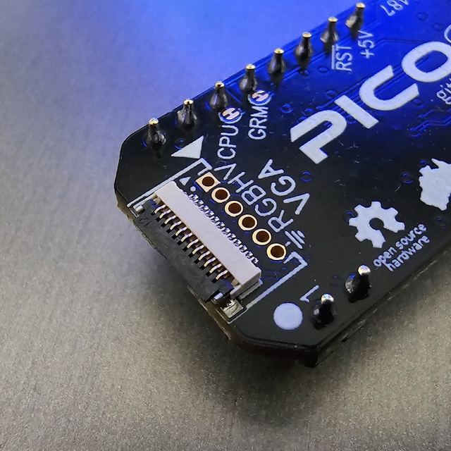
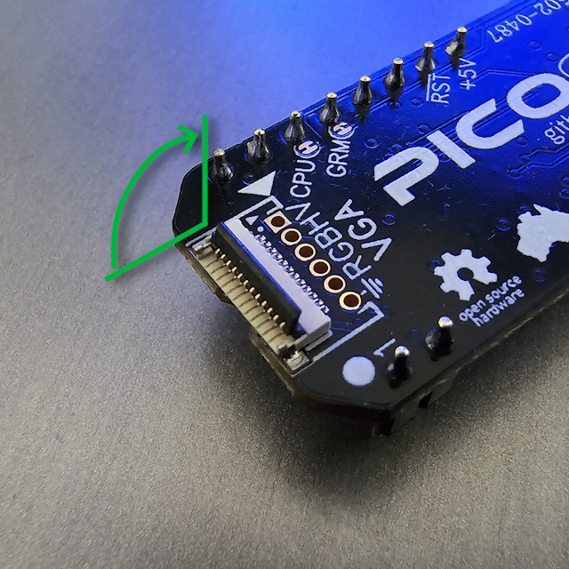
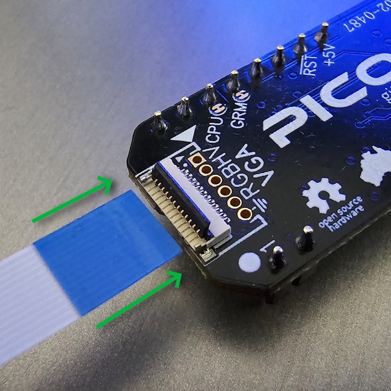
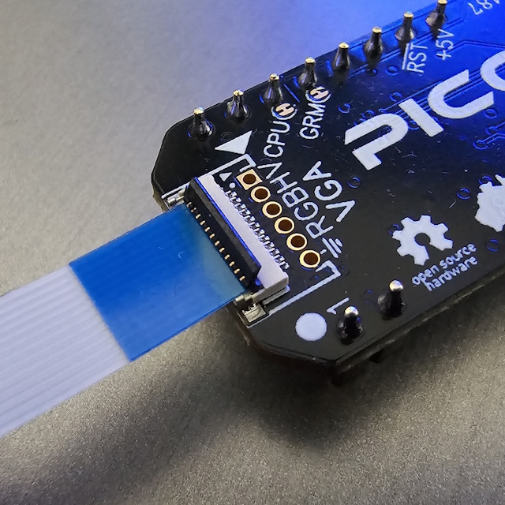
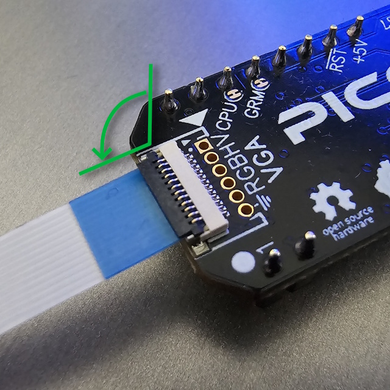
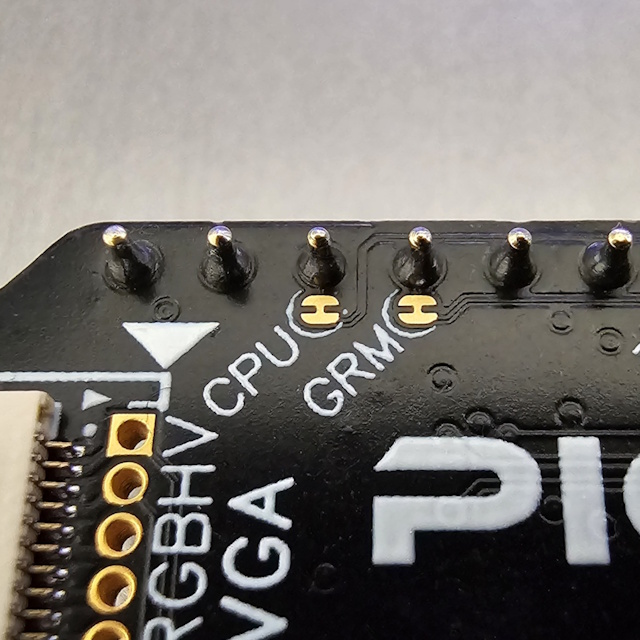
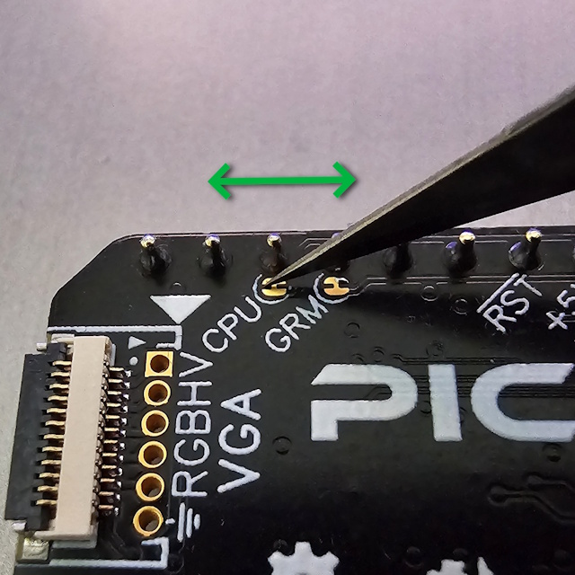
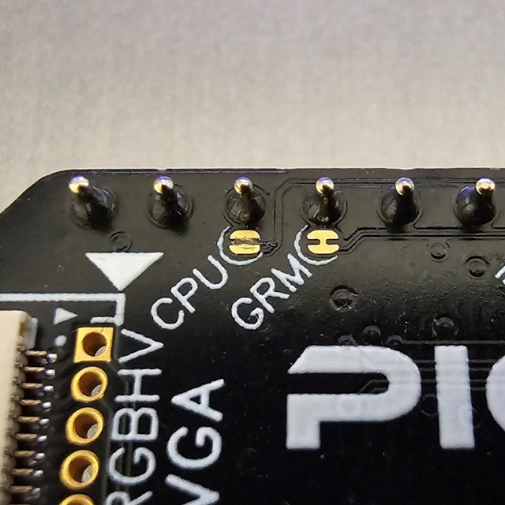
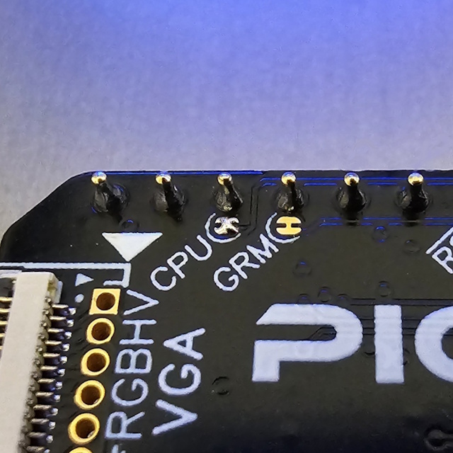

# PICO9918 Documentation

[&larr; Back to PICO9918](../README.md)

## Contents

* [FFC Connector](#ffc-connector)
* [CPU and GRM Jumpers](#cpu-and-grm-jumper)
* [MDE1 Pin](#mde1-pin)

---

## FFC Connector

The FFC (Flat Flexible Cable) connector on the PICO9918 v1.2+ is used to attach accessories such as the VGA or [Digital A/V dongle](../README.md#digital-av-hdmi-dongle-new).

If you're ordering replacement cables from a thirdparty, look for 12 pin 0.5mm pitch FFC cables.

### Connecting the FFC Cable

**Step 1** — Open the FFC connector latch by lifting the locking tab upward.

**Step 2** — Insert the FFC cable into the connector with the contacts facing down.

**Step 3** — Push the cable fully into the connector until it seats flush.

**Step 4** — Close the latch by pressing the locking tab back down until it clicks.

**Step 5** — Confirm the cable is secure and the latch is fully closed.

---

## CPU and GRM Jumper

The PICO9918 v1.x boards include solder jumpers for configuring the CPU clock and GRM clock outputs. In some cases, it might be necessary to cut  the CPU jumper to ensure compativility with TMS992xA devices. One example being to use the ColecoVision Expansion module 1 with your ColecoVision.

### Cutting a jumper

The CPUCLK and GROMCLK jumpers are located on the board as shown below.

Using a sharp hobby knife, position the blade across the jumper trace you wish to cut.

Apply firm pressure to cut through the trace. Use a multimeter to confirm the jumper is fully open.

### Replacing a jumper

To re-connect a cut jumper, apply a small solder blob onto the pad.

---

## MDE1 Pin

One side of the PICO9918 v1.x includes 10 holes, but shipped units come with a 9-pin header installed. The unpopulated hole is reserved for the **MDE1** (Mode 1) pin.

MDE1 is not currently used by the firmware but is included on the board for future expansion — for example, to support V9938 and other enhanced VDP variants which make use of this pin.

---
