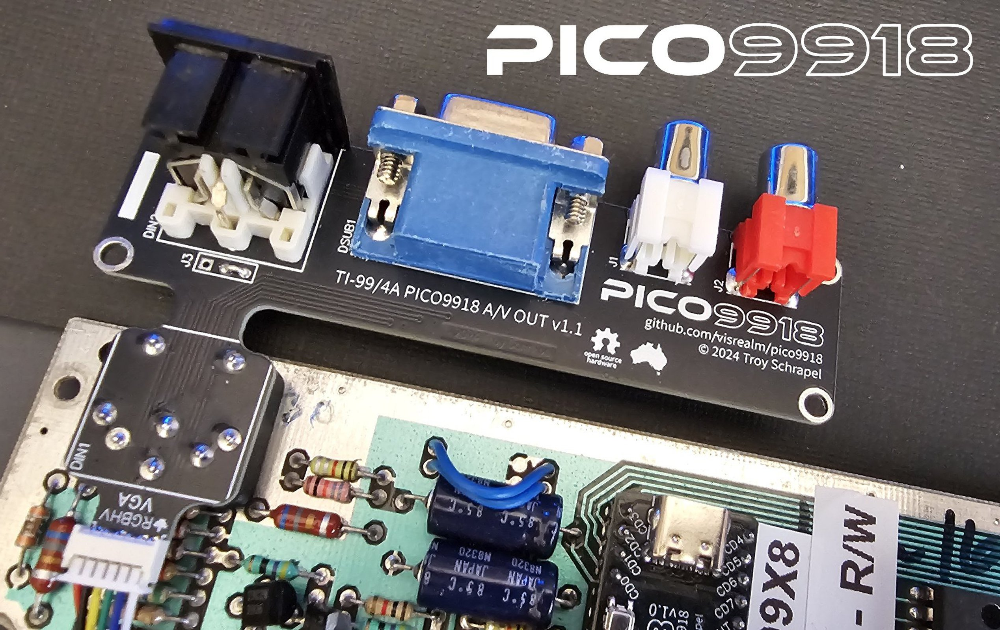
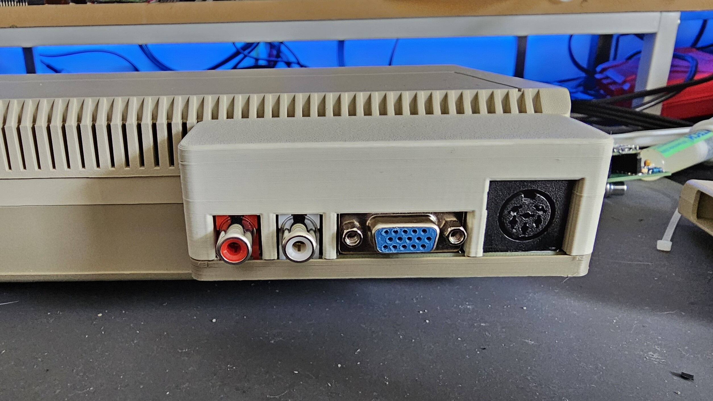
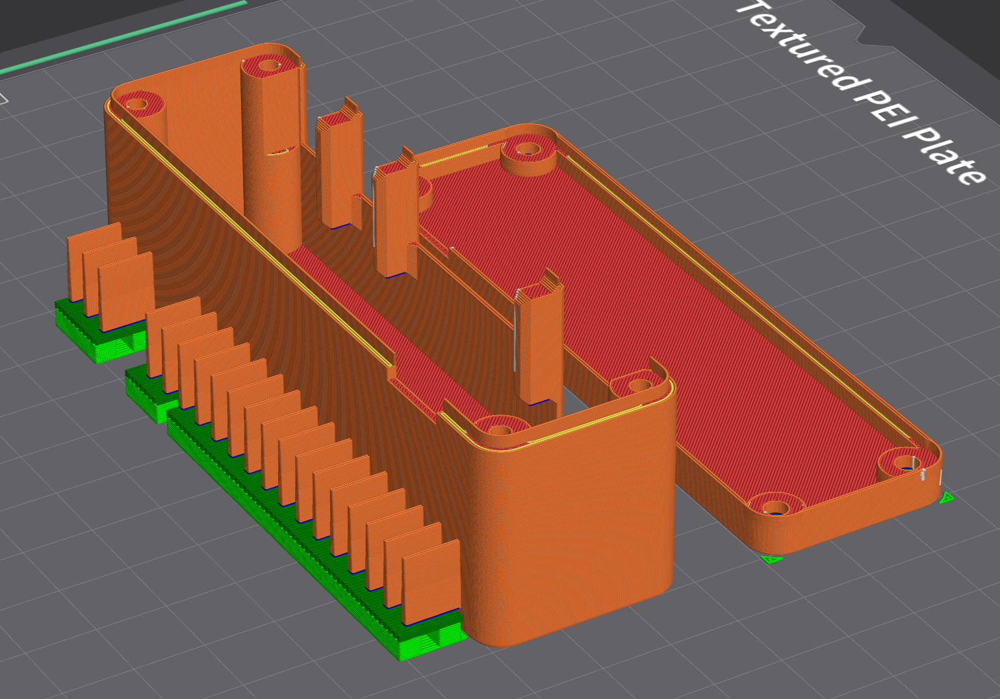

## PICO9918 STLs

Any 3D print or CAD files related to the PICO9918.

## TI-99/4A no-cut mod

The no-cut mod for the TI-99/4A consists of a custom PCB which replaces the original A/V DIN socket:

The PCB is the supported by the printed enclosure:

### PCB

There are two versions of the PCB. One for v0.4 - v1.1 boards with JST connectors and another for v1.2+ boards with an FFC connector.

See [pcb/](pcb/)

To install the PCB, first remove the A/V connector from your TI-99/4A. Then install using the 3D printed spacer: [stl/pico9918-nocut-ti99-pcb-spacer.stl](stl/pico9918-nocut-ti99-pcb-spacer.stl)

### Enclosure

The vent holes on the black versus beige TI-99/4As are slightly different. For that reason, find either the beige or black version of the enclosure top and the generic enclosure bottom. They should be printed like this:

See [stl/](stl/)