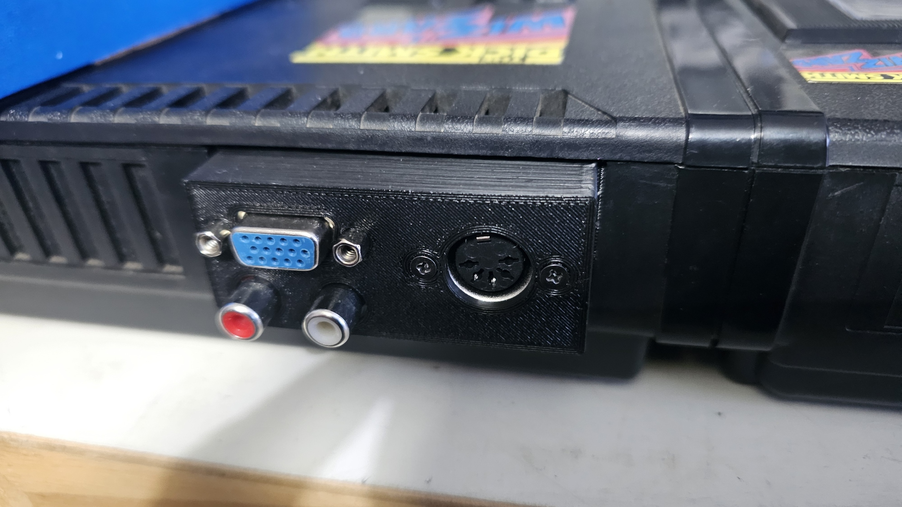

## CreatiVision no-cut mod

The no-cut mod for the CreatiVision consists of 3D-printable parts which replace the rear panel cover, allowing the PICO9918's VGA and RCA connectors to pass through.

### 3D Printed Parts

There are two STL files:

- **[pico9918-nocut-creativision-vga.stl](stl/pico9918-nocut-creativision-vga.stl)** - Rear panel cover with VGA cutout
- **[pico9918-nocut-creativision-vga-rca-cover.stl](stl/pico9918-nocut-creativision-vga-rca-cover.stl)** - Internal RCA cover

See [stl/](stl/)
