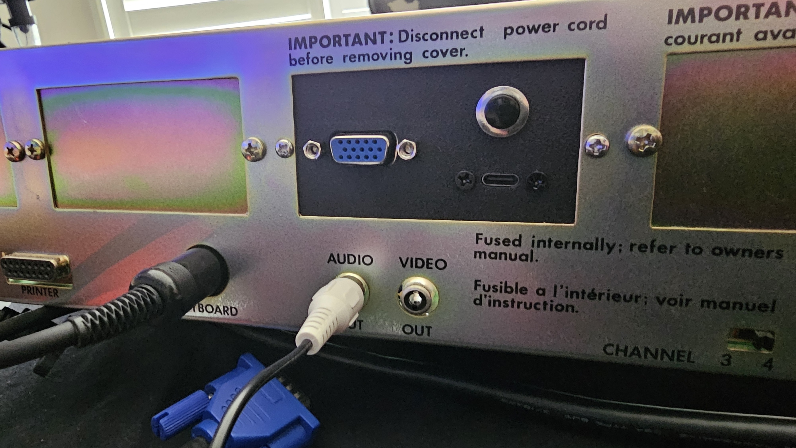
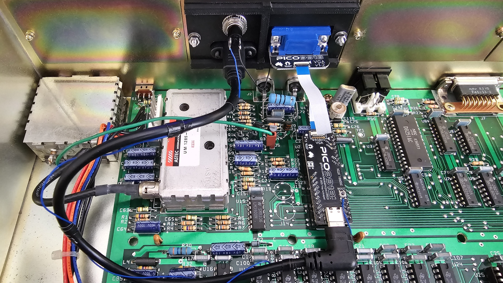

## NABU no-cut mod

The no-cut mod for the NABU consists of 3D-printable parts which replace the rear panel cover, allowing the PICO9918's video and USB boot connectors to pass through.

### 3D Printed Parts

There are four STL files to cover different output and connector configurations:

- **[pico9918-nocut-nabu-vga.stl](stl/pico9918-nocut-nabu-vga.stl)** - Rear panel cover with VGA cutout
- **[pico9918-nocut-nabu-vga-usb-boot.stl](stl/pico9918-nocut-nabu-vga-usb-boot.stl)** - Rear panel cover with VGA and USB boot cutouts
- **[pico9918-nocut-nabu-hdmi.stl](stl/pico9918-nocut-nabu-hdmi.stl)** - Rear panel cover with HDMI cutout
- **[pico9918-nocut-nabu-hdmi-usb-boot.stl](stl/pico9918-nocut-nabu-hdmi-usb-boot.stl)** - Rear panel cover with HDMI and USB boot cutouts

See [stl/](stl/)
